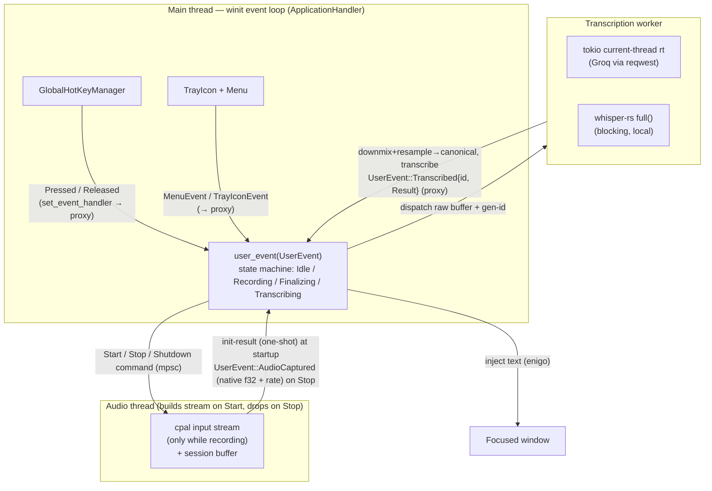
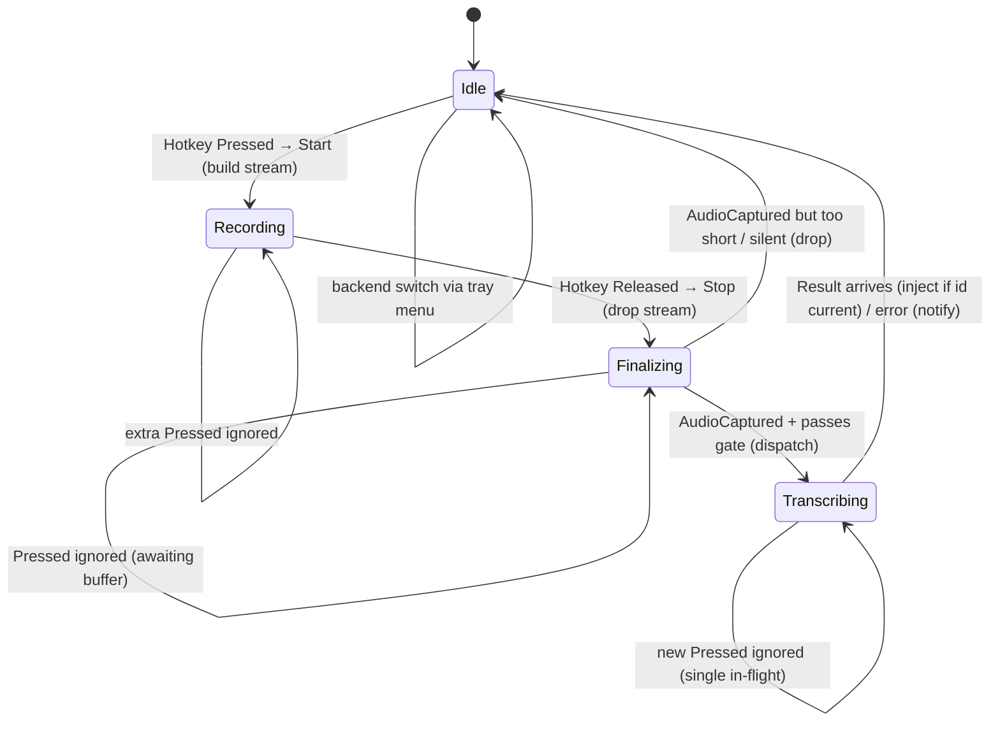
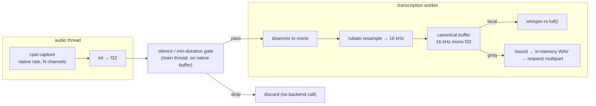

# feat: Xiuxiu — Windows voice dictation tray app

## Summary

Build a resident Windows system-tray app that records the microphone while a global hotkey is held, transcribes the audio on release (via Groq's hosted Whisper API or a local whisper.cpp model), and types the result into the focused window. v1 ships both backends behind one runtime switcher; Groq is built first as an end-to-end walking skeleton, then the local backend is layered in.

---

## Problem Frame

The goal is a near-invisible utility: launch it, hold a key, talk, release, and the text appears wherever the cursor is — no window, no context switch. The existing options each leave a gap this tool closes: Windows' built-in Voice Typing (`Win+H`) is cloud-only with no offline/private mode and no provider choice; hosted tools like Wispr Flow require an account and send all audio to one provider; Talon is powerful but heavyweight and oriented to voice *control*, not quick dictation. None offers a single resident tool that switches between fast cloud transcription and fully-offline local inference at runtime, requires no account, and injects into any focused window including the terminal. That combination — provider choice (privacy when you want it, speed when you don't) behind a zero-friction hold-to-talk key — is the specific gap.

**Success target.** v1 succeeds if the perceived round trip from key-release to text-appearing feels immediate for short dictations (target: well under a second on Groq for a typical phrase) and the transcription is accurate enough for everyday prose and terminal commands. A technically-complete tool that feels laggy or garbles terminal input fails the "near-invisible" goal even with every requirement met.

The hard parts are not the individual crates — it is making three asynchronous event sources (a global hotkey, a tray menu, and transcription results arriving from worker threads) cooperate on a single OS message pump without a visible window, while keeping the UI thread responsive during network calls and blocking local inference. The build target is Windows-only (`x86_64-pc-windows-msvc`); the architecture stays cross-platform-friendly to avoid blocking a future macOS port.

This plan is written on a Linux dev box for traceability; compilation, testing, and verification run on a Windows machine with the MSVC toolchain (see Build & Operational Notes).

---

## Requirements

### Core dictation flow

- R1. Holding the configured global hotkey (default `Ctrl+Shift+Space`) starts microphone capture; releasing it stops capture and dispatches the audio for transcription.
- R2. Transcribed text is injected into whatever window has focus at release time, as Unicode keyboard input.
- R3. The app is resident with no window and no console in release builds; its only UI is a system-tray icon. The tray icon visibly distinguishes idle from recording so the user always knows when the microphone is live.
- R4. A very short press, an empty buffer, or near-silence is dropped without calling any backend.
- R5. While a transcription is in flight, a new hotkey press is ignored (single in-flight policy); a stale result is never injected.

### Transcription backends

- R6. Two backends are available — `local` (whisper.cpp via `whisper-rs`) and `groq` (hosted API) — producing the same `String` output so the injection path is backend-agnostic.
- R7. The active backend is selectable at runtime from the tray menu, with a checkmark on the active one; switching takes effect immediately while the app is idle.
- R8. The Groq backend POSTs an in-memory WAV as multipart to `https://api.groq.com/openai/v1/audio/transcriptions` with `model=whisper-large-v3-turbo`, `response_format=json`, and a Bearer token, and parses `{"text": "..."}`.
- R9. The local backend loads a ggml model once at startup and keeps it resident in memory; it is not reloaded per invocation. Loading is pinned to startup (not deferred to first use) so a load failure surfaces at a single, well-defined point with a fallback path (R14).

### Configuration

- R10. `BACKEND`, `GROQ_API_KEY`, and `WHISPER_MODEL_PATH` are read from the environment or a `.env` file located next to the executable (not the current working directory), with real environment variables overriding `.env`.
- R11. Required config is validated per backend at startup: `groq` requires `GROQ_API_KEY`; `local` requires a readable model file at `WHISPER_MODEL_PATH`.

### Resilience

- R12. A failed Groq call is dropped without crashing; the tray icon may flash to signal failure.
- R13. If the microphone is unavailable at launch, the user is notified via a tray notification.
- R14. If `local` is selected but the model file is missing or fails to load, the app falls back to `groq` (when a key is present) and shows a tray notification. This applies both at startup (initial backend = `local`) and on a runtime switch to `local` from the tray menu: a switch to an unusable local backend is rejected with a notification and the previously active backend stays in effect — the app never silently accepts a backend that will fail at the next dictation.
- R15. Panics and errors are written to a log file next to the executable; they are never silently lost despite the absence of a console.
- R16. Transcribed text is never written to logs at any level, and the `GROQ_API_KEY` never appears in logs, error messages, or `Debug` output. Both are sensitive (transcripts are user speech; the key is a billable credential).

---

## Key Technical Decisions

- KTD1. **Single canonical audio buffer feeds both backends.** Capture is preprocessed once into 16 kHz mono f32 PCM. The local backend consumes that buffer directly; the Groq backend wraps it in an in-memory WAV. Groq downsamples to 16 kHz mono server-side regardless, so sending a 16 kHz file is lossless for accuracy, smaller on the wire, and removes a second preprocessing path. (Confirmed against Groq docs and the `whisrs` project.) This assumes every backend wants Whisper-class 16 kHz mono input — true for both v1 backends; a future backend needing higher fidelity (some cloud STT accepts 44.1 kHz stereo) would require retaining the native-rate buffer. That is an accepted v1 constraint, not an oversight.
- KTD2. **`rubato` (`FftFixedInOut<f32>`) for resampling, not naive linear.** Band-limited resampling preserves higher-frequency speech content that linear interpolation aliases away, at negligible cost relative to inference. The 48 kHz→16 kHz path is a fixed 3:1 ratio, which `FftFixedInOut` handles efficiently. (Pattern taken from `keyless`.)
- KTD3. **One winit event loop, one `UserEvent` enum, all sources forwarded via `EventLoopProxy`.** winit 0.30's `ApplicationHandler` + `run_app` is the only non-deprecated API. Tray events, menu events, hotkey events, finalized capture buffers from the audio thread, and worker-thread transcription results are all delivered as variants of a single `UserEvent` and handled in `user_event()` — the single coordination point. The `EventLoopProxy` is the cross-thread wakeup mechanism for both the audio thread and the transcription worker. The tray icon, hotkey manager, and event loop are all created on the main thread (a hard Windows requirement).
- KTD4. **Explicit tokio runtime on a worker thread, not `#[tokio::main]`.** The core app is synchronous (winit/cpal/whisper). A current-thread tokio runtime is built and driven via `block_on` on the transcription worker thread so the network call never touches the UI thread; the result is posted back through the `EventLoopProxy`. TLS uses `rustls-tls` to avoid an OpenSSL/native-tls build dependency on Windows. The Groq `Client` sets a concrete connect timeout (5 s) and total request timeout (15 s) — not just an upper bound — so a stalled network cannot lock the single-in-flight state machine for longer than that worst case (a dead connection fails fast at 5 s; a hung response caps at 15 s).
- KTD5. **Blocking local inference on a worker thread; model loaded once.** `whisper-rs`'s `full()` is synchronous, so it runs off the UI thread. The expensive immutable `WhisperContext` (the model) is loaded once and shared via `Arc`; a cheap per-utterance `WhisperState` is created per call. Switching to Groq does not unload the model.
- KTD6. **`ActiveBackend` enum dispatch, not a `dyn` trait.** The two backends have divergent execution models — Groq is async (tokio `block_on`), local is synchronous blocking (`whisper-rs`) — so a shared `async fn transcribe` trait would force `async_trait` (a proc-macro) plus `Box<dyn>` object-safety friction for exactly two known branches. Instead, an `ActiveBackend` enum (`Groq(GroqBackend)` / `Local(LocalWhisperBackend)`) is matched on the worker thread, calling each backend's own (sync or async-via-`block_on`) path directly. Both arms return `Result<String, TranscribeError>`, so the injection path stays backend-agnostic (satisfies R6). A `TranscriptionBackend` trait can be reintroduced if a third backend or a mocking need appears; for v1 the enum is simpler and dependency-free.
- KTD7. **Generation-id tagged transcriptions, single in-flight policy.** Each recording is tagged with a monotonically increasing id; the worker echoes it back with the result, and the event loop drops results whose id is stale. A new hotkey press while not idle is ignored. **Under the current single-in-flight rule the id is always current — the staleness check can never fire** (no second dispatch can exist while one is in flight). It is deliberate defense-in-depth: it costs one `u64` and one comparison, and it is the invariant that keeps a future relaxation of single-in-flight (or an out-of-order worker result during shutdown) from injecting text from an abandoned recording. The state-machine gate is the primary guarantee for R5; the id is the backstop. Implementers should treat the stale-id branch as intentionally unreachable today, not dead code to delete.
- KTD8. **File logging + custom panic hook, with secret/PII hygiene.** Under `#![windows_subsystem = "windows"]` there is no console, so stdout/stderr (including panic messages) go nowhere. Logging uses `tracing` + `tracing-appender` to a file next to the exe, and a `std::panic::set_hook` writes panic + backtrace to that file (and surfaces a tray notification / message box). All whisper.cpp `print_*` flags are disabled. **Two classes of data are excluded from logs entirely (R16):** the `GROQ_API_KEY` and the transcribed text itself (user speech is PII). Transcripts are referenced by length/hash in logs, never by content; the key never reaches a log or `Debug` impl. The log file is created with current-user-only permissions where the platform allows, since it shares a directory with config.
- KTD9. **Config via `dotenvy`, resolved by a defined precedence, with a single secret-hygiene owner.** A tray app launched from a shortcut or the Startup folder has an unpredictable cwd, so config is never read from cwd. Resolution precedence: real environment variables first, then `%APPDATA%\xiuxiu\.env` (the recommended user-only-readable location), then `<exe_dir>/.env` (the spec's binary-adjacent location, for portable/single-user installs). `dotenvy` (the maintained successor to `dotenv`) loads whichever `.env` is found. **Secret hygiene has one owner:** the key lives only inside `Config` and is formatted into the `Authorization` header at the single point of use in `groq.rs`; `Config`, `TranscribeError`, and every backend type use hand-written or redacting `Debug` so the key cannot leak through any `Debug`-print. The `.env`-next-to-exe path is documented (per spec) but the README warns against placing it in a world-readable directory and recommends the `%APPDATA%` location on shared machines (see U10).
- KTD10. **Silence / minimum-duration gate before dispatch.** On release, the buffer is checked for minimum duration (~300–500 ms) and energy above a silence threshold before any backend is called. This prevents whisper hallucinating text from silence and avoids paying Groq's 10-second billing minimum for an accidental tap (satisfies R4).
- KTD11. **Groq-first build sequencing.** The Groq backend is far lighter to stand up than the local FFI backend (no libclang/MSVC/CMake build chain, no model download). Building it first yields a complete, testable end-to-end skeleton (hotkey → capture → preprocess → transcribe → inject) before the heavier local backend is added.
- KTD12. **The `cpal` `Stream` lives on a dedicated audio thread, never on the event-loop thread; the buffer hand-back is asynchronous.** The `Stream` is `!Send`, and `build_input_stream`/`drop` make blocking WASAPI calls (tens–hundreds of ms, COM-sensitive) — running them on the winit thread would stall the UI at the exact moment of a hotkey press. The audio thread owns the stream and the main thread coordinates only via lightweight signals: a `std::sync::mpsc` **command channel** (`Start`/`Stop`/`Shutdown`), a one-shot **init-result channel** reporting mic-availability synchronously at startup (source for R13), and — critically — the finalized capture is returned **asynchronously**: the audio thread invokes a caller-provided sink that posts `UserEvent::AudioCaptured` through the `EventLoopProxy`, waking the UI thread rather than blocking it on a `recv`. On `Stop`, the audio thread tears down the stream (flushing the final callback), snapshots the session buffer, and posts `AudioCaptured`; the main thread never blocks waiting for a callback edge, and the snapshot is defined to include every sample up to and including the callback that observes the stop. The audio thread sends the buffer in its native format (post int→f32) with sample-rate and channel count; downmix/resample to canonical 16 kHz happens on the transcription worker (off both the UI and audio threads). (Grounded in `whisrs`'s `capture.rs` command/one-shot coordination and `keyless`'s "non-Send stream off the responsive thread" split.)
- KTD13. **Privacy-first capture: the microphone is open only while recording (build-on-press), not pre-warmed.** This is a committed product decision, not a latency-tuning choice deferred to measurement. The product identity is a tool that "feels idle" and earns trust to sit resident; a permanently-open mic (the warm-stream alternative) keeps the OS "microphone in use" indicator lit continuously, which reads as "always listening" and undermines that identity. So the audio thread builds the stream on the `Start` command (hotkey press) and drops it on `Stop` (release), and the session buffer is dropped immediately after dispatch to the worker. The cost is WASAPI cold-open latency on each press (can exceed ~100 ms), which can clip the first instant of speech; this is mitigated by (a) a one-time device-open-and-close probe at startup that validates the mic for R13 *and* warms driver/format caches so the first real press is not a cold open, and (b) the natural press-then-speak cadence of hold-to-talk. The OS mic indicator now lights only during actual capture, and the tray icon mirrors it (R3). If cold-open latency proves severe on specific target hardware, a warm-stream mode is the documented fallback — but the default is decided, and the privacy posture is the reason.

---

## High-Level Technical Design

### Thread & event topology

All UI coordination lives on the main thread; audio capture and transcription run off it and report back through the `EventLoopProxy`.



### Recording state machine



### Audio preprocessing pipeline (single canonical path)



### One dictation cycle (sequence)

```mermaid
sequenceDiagram
  participant U as User
  participant EL as Event loop (main)
  participant Cap as Audio thread
  participant W as Worker
  Note over Cap: startup: open+close device probe (validates mic, warms caches); no stream held
  U->>EL: Hotkey Pressed
  EL->>Cap: Start command (Idle→Recording)
  Cap->>Cap: build cpal stream, accumulate session buffer
  U->>EL: Hotkey Released
  EL->>Cap: Stop command (Recording→Finalizing)
  Cap->>Cap: drop stream (flush), snapshot buffer
  Cap-->>EL: UserEvent::AudioCaptured{native f32, rate}
  EL->>EL: gate (duration/energy); drop session buffer
  EL->>W: dispatch(buffer, gen-id) (Finalizing→Transcribing)
  W->>W: downmix+resample→canonical, transcribe (active backend)
  W-->>EL: UserEvent::Transcribed{id, text}
  EL->>EL: id current? (Transcribing→Idle)
  EL->>U: enigo types text into focused window
```

---

## Output Structure

```
xiuxiu/
├── Cargo.toml
├── .env.example
├── README.md
├── assets/
│   └── tray.ico
└── src/
    ├── main.rs              # entry; windows_subsystem; bootstrap logging, config, loop
    ├── config.rs            # Config struct, dotenvy load from exe dir, per-backend validation
    ├── logging.rs           # tracing file logger + panic hook
    ├── app.rs               # ApplicationHandler, UserEvent enum, recording state machine
    ├── tray.rs              # tray icon + menu construction, checkmarks, notifications
    ├── inject.rs            # enigo text injection
    ├── audio/
    │   ├── mod.rs
    │   ├── capture.rs       # audio thread: build/drop cpal stream per recording, command channel, init probe
    │   └── preprocess.rs    # int→f32, downmix, rubato resample, silence/duration gate
    └── transcription/
        ├── mod.rs           # ActiveBackend enum + dispatch, TranscribeError
        ├── groq.rs          # GroqBackend (reqwest multipart, tokio, error mapping)
        └── local.rs         # LocalWhisperBackend (WhisperContext, per-call state)
tests/
└── config_env.rs           # integration: load config from a real temp .env (binary boundary)
```

Pure-logic tests (config parsing, downmix/resample/gate math, WAV encoding, Groq response/error parsing, text sanitize/chunk, state-machine transitions) live in inline `#[cfg(test)]` modules in their source files — one test binary, co-located with the code. The `tests/` directory holds only scenarios that must cross the compiled-binary boundary (loading config from a real on-disk `.env`). The tree is a scope declaration, not a constraint — the implementer may adjust layout if implementation reveals a better one. Per-unit **Files** lists remain authoritative.

---

## Implementation Units

> Crate versions below reflect the latest stable as of 2026-06-04 and carry API-shape implications (winit's `ApplicationHandler`, enigo's `Settings`/`Keyboard::text`, reqwest multipart). Confirm latest at build time; example projects (`whisrs`, `keyless`) pin older versions but the API patterns are consistent.

### Phase 1 — Foundation & architecture de-risking

### U1. Project scaffolding, configuration, logging & panic safety

- **Goal:** A buildable binary crate that loads and validates config by the KTD9 precedence (env → `%APPDATA%\xiuxiu\.env` → exe-dir `.env`), initializes file-based logging with secret/PII hygiene, installs a panic hook, and exits cleanly. No audio/UI yet.
- **Requirements:** R3 (no console), R10, R11, R15, R16.
- **Dependencies:** none.
- **Files:**
  - `Cargo.toml` (create) — deps with feature flags: `reqwest` (`multipart`, `json`, `rustls-tls`), `tokio` (`rt`, `macros`), `cpal`, `whisper-rs`, `tray-icon`, `winit`, `global-hotkey`, `enigo`, `hound`, `rubato`, `serde`/`serde_json`, `dotenvy`, `tracing`, `tracing-appender`, `anyhow`/`thiserror`.
  - `src/main.rs` (create) — `#![cfg_attr(not(debug_assertions), windows_subsystem = "windows")]`; bootstrap order: logging → panic hook → config → (later) loop.
  - `src/config.rs` (create) — `Backend` enum (`Local`/`Groq`), `Config` struct holding the key in a redacting newtype (hand-written `Debug` that prints `***`), `load()` resolving the KTD9 precedence via `dotenvy::from_path` against `%APPDATA%\xiuxiu\` then `current_exe().parent()`, env-overrides-file precedence, per-backend validation. Inline `#[cfg(test)]` module.
  - `src/logging.rs` (create) — `tracing-appender` file writer next to exe (created with current-user-only ACL where the platform allows); `std::panic::set_hook` writing message + backtrace to the log. Inline `#[cfg(test)]` module for the panic-hook write path.
  - `.env.example` (create); `tests/config_env.rs` (create) — integration test loading config from a real temp `.env`.
- **Approach:** Keep `windows_subsystem` gated to release (`not(debug_assertions)`) so debug builds retain a console for development. Config validation returns a typed error the bootstrap surfaces (later as a tray notification); for U1 it logs and exits non-zero. The key exists only inside `Config`'s redacting newtype; nothing else stores or prints it (KTD9). Establish the logging hygiene rule now (KTD8): transcripts and the key are never logged.
- **Patterns to follow:** `dotenvy::from_path` (not `dotenv`); `whisrs` config/secret-hygiene approach; redacting-`Debug` newtype for the credential.
- **Test scenarios:**
  - Covers R10. `load()` reads `BACKEND`/`GROQ_API_KEY`/`WHISPER_MODEL_PATH` from a `.env` fixture resolved relative to a supplied base dir.
  - Covers R10. A real environment variable overrides the same key present in `.env`.
  - Covers R10. With both `%APPDATA%\xiuxiu\.env` and an exe-dir `.env` present (simulated via injected base paths), the `%APPDATA%` value wins; env vars win over both.
  - Covers R11. `BACKEND=groq` with no `GROQ_API_KEY` returns a validation error naming the missing key.
  - Covers R11. `BACKEND=local` with a `WHISPER_MODEL_PATH` pointing at a nonexistent file returns a validation error.
  - `BACKEND` unset defaults per spec; an unrecognized `BACKEND` value errors.
  - Edge: no `.env` anywhere but all vars in the environment → loads successfully.
  - Covers R16. The key newtype's `Debug`/`Display` renders `***`, and `Config` `Debug` output does not contain the key value.
- **Verification:** `cargo build` succeeds on Windows MSVC; debug run logs startup and exits; a logged panic appears in the file; release build produces no console window; the log file is not world-readable.

### U2. Tray + hotkey + event-loop shell (the coordination core)

- **Goal:** A running winit `ApplicationHandler` app on the main thread with a tray icon, a Backend/Quit menu, and a registered global hotkey — all events funneled through one `UserEvent` enum. Hotkey press/release and menu clicks are logged; Quit exits. No audio yet. This de-risks the central architecture first.
- **Requirements:** R1 (hotkey detection), R3, R7 (menu scaffold).
- **Dependencies:** U1.
- **Files:**
  - `src/app.rs` (create) — `UserEvent` enum (`TrayIcon`, `Menu`, `Hotkey`, `Transcribed{ id, Result<String,String> }`); `App` struct implementing `ApplicationHandler<UserEvent>`; `user_event()` dispatch skeleton; initial `AppState::Idle`.
  - `src/tray.rs` (create) — build `TrayIcon` with idle/recording icon variants (`assets/tray-idle.ico`, `assets/tray-recording.ico`), menu (`Backend` submenu with `Local`/`Groq` + checkmark, `Quit`); helpers to set the icon by state and fire tray notifications.
  - `src/main.rs` (modify) — `EventLoop::<UserEvent>::with_user_event().build()`; create proxy; `set_event_handler` forwarders for `TrayIconEvent`/`MenuEvent`/`GlobalHotKeyEvent`; create `GlobalHotKeyManager` + register `Ctrl+Shift+Space`; create tray in `StartCause::Init`; `run_app`.
  - `assets/tray-idle.ico`, `assets/tray-recording.ico` (create/placeholder).
- **Approach:** Per KTD3 — everything on the main thread, `ControlFlow::Wait`, tray created in `new_events`/`StartCause::Init` (not before the loop, not in `resumed`). Keep `GlobalHotKeyManager`, `TrayIcon`, and `Menu` owned by `App` for the process lifetime (dropping unregisters/removes). Match `HotKeyState::Pressed`/`Released` and the hotkey id. Quit menu item → `event_loop.exit()`.
- **Patterns to follow:** tray-icon `examples/winit.rs`; the `set_event_handler` → `EventLoopProxy` forwarding idiom (do not also poll `::receiver()`).
- **Test scenarios:** `Test expectation: none — this unit is OS/event-loop integration with no pure logic to unit-test.` Verified manually (below).
- **Verification (manual, Windows):** Tray icon appears; a clean press/release of `Ctrl+Shift+Space` logs exactly one `Pressed` then one `Released` (confirming `MOD_NOREPEAT` and the ~50 ms release poll). **Hotkey-reliability matrix (KTD13 / A1 risk):** exercise modifier-release ordering — release Space before Ctrl/Shift, release Ctrl/Shift before Space, very fast tap, and hold across a focus change — and record for each whether `Pressed`/`Released` still pair correctly and how much trailing audio the ~50 ms poll drops; decide whether a short post-release capture tail is needed. Clicking `Local`/`Groq` logs the menu event; `Quit` exits; release build shows no console.

### Phase 2 — Audio & Groq walking skeleton

### U3. Audio capture & preprocessing pipeline

- **Goal:** A dedicated audio thread that builds the `cpal` stream on a `Start` command and drops it on `Stop` (mic open only while recording, per KTD13), accumulates the session buffer while recording, and posts the finalized native-format buffer back asynchronously as `UserEvent::AudioCaptured`. Plus the pure preprocessing functions (downmix, resample, gate) the worker and main thread call.
- **Requirements:** R1, R4, R13 (mic-missing surfaces via the init-result channel at startup, surfaced by U9).
- **Dependencies:** U1.
- **Files:**
  - `src/audio/mod.rs` (create), `src/audio/capture.rs` (create) — `AudioHandle` (Send: holds the `std::sync::mpsc` command sender, the one-shot init-result receiver; the `!Send` `Stream` never crosses the boundary) spawning the audio thread. The thread: at startup does a device-open-and-close **probe** (validates `default_input_device()`/`default_input_config()`, warms driver/format caches) and reports success/failure on the one-shot init-result channel (R13); then loops on the command channel — `Start` builds the stream (branching on `default_input_config().sample_format()` for `f32`/`i16`/`u16`, converting ints to f32 in the callback, appending to a session `Vec<f32>`), `Stop` drops the stream (flushing the final callback), snapshots the buffer, and emits a `CapturedAudio { samples, sample_rate, channels }` through a caller-provided `Box<dyn Fn(CapturedAudio) + Send>` sink, `Shutdown` exits. (`capture.rs` depends only on `CapturedAudio`, not on the event enum; U6 wires the sink to `proxy.send_event(UserEvent::AudioCaptured(..))`, so this unit stays decoupled from `app.rs`.) Inline `#[cfg(test)]` module for the session-buffer accumulation logic (factored out of the callback).
  - `src/audio/preprocess.rs` (create) — `to_canonical(samples, src_rate, channels) -> Vec<f32>`: downmix (average interleaved channels), `rubato::FftFixedInOut<f32>` resample to 16 kHz with the chunked accumulator (drain `input_frames_next()` per call); `passes_gate(&[f32], rate, channels) -> bool` (min duration + RMS energy threshold, computed on the native buffer before resampling). Inline `#[cfg(test)]` module.
- **Approach:** Per KTD1/KTD2/KTD10/KTD12/KTD13. The `Stream` is `!Send` and build/drop block on WASAPI, so it stays pinned to the audio thread; the main thread only sends commands and receives `AudioCaptured` as an event (never a blocking `recv`, per KTD12). Build-on-press keeps the mic closed at idle (KTD13); the startup probe absorbs cold-open cost for the first press. The snapshot includes every sample up to the callback that observes `Stop`. Capture at the device's native rate/format (do not request 16 kHz from WASAPI — unreliable on Windows); `passes_gate` runs on the native buffer (main thread, cheap), and `to_canonical` runs on the worker (KTD12), so neither downmix nor resample touches the UI or audio threads.
- **Patterns to follow:** `whisrs` `capture.rs` command + init-result one-shot coordination and `i16→f32` conversion; `keyless` rubato `FftFixedInOut` chunked-accumulator.
- **Test scenarios:**
  - Covers R1. Downmix: a 2-channel interleaved buffer averages to mono of half the length with correct values; mono input passes through unchanged.
  - Resample: a 48 kHz sine resampled to 16 kHz yields ⅓ the samples (±chunk remainder) and preserves dominant frequency (FFT bin check or zero-crossing count).
  - i16/u16 → f32 conversion maps full-scale values into [-1.0, 1.0].
  - Covers R4. `passes_gate` returns false for a buffer shorter than the min-duration threshold (accounting for channel count), false for a full-length silent (all-zeros) buffer, and true for a normal-energy buffer of sufficient length.
  - Covers R1. Session-buffer accumulation logic (factored from the callback): samples appended between `Start` and `Stop` produce the expected concatenated buffer; the snapshot taken at `Stop` includes the last appended chunk exactly once.
  - Edge: empty input buffer → gate false, no panic.
- **Verification:** Unit tests green; on Windows, driven by a temporary `Start`/`Stop` harness (full hotkey-driven verification lands with U6), a logged dump of native sample count, channels, rate, and post-resample length matches expected ratios, and the OS mic indicator lights only between `Start` and `Stop`; the mic-missing init-result fires when no input device is present.

### U4. Backend dispatch enum + Groq backend

- **Goal:** Define the `ActiveBackend` enum + `TranscribeError`, and implement the Groq backend: encode the canonical buffer to an in-memory WAV, POST it as multipart with auth, parse the text, and map errors.
- **Requirements:** R6, R8, R12.
- **Dependencies:** U1. (Not U3 — this unit only consumes the canonical `&[f32]` slice contract defined inline; it imports nothing from `capture.rs`/`preprocess.rs`, so U3 and U4 can be built in parallel.)
- **Files:**
  - `src/transcription/mod.rs` (create) — `ActiveBackend` enum (`Groq(GroqBackend)` / `Local(LocalWhisperBackend)`) with a `transcribe(&self, audio: &[f32]) -> Result<String, TranscribeError>` dispatch that matches the variant (KTD6 — no `dyn`/`async_trait`); `TranscribeError` (network/timeout/auth/rate-limit/too-large/decode), with a redacting `Debug` so the key can never leak through it (R16). Inline `#[cfg(test)]` module.
  - `src/transcription/groq.rs` (create) — `GroqBackend` holding one reused `reqwest::Client` (built with `.connect_timeout(5s)` + `.timeout(15s)`, `rustls-tls`); `hound`-encode canonical buffer to 16 kHz mono WAV via `Cursor<Vec<u8>>` (finalize before reading); multipart `file` + `model=whisper-large-v3-turbo` + `response_format=json` + `language`; `bearer_auth`; deserialize `{"text": ...}`; pre-check 25 MB; map 401/413/429/5xx. Inline `#[cfg(test)]` module (WAV encoding + response/error parsing, no network).
- **Approach:** Per KTD1/KTD4/KTD6. Build the WAV from the already-canonical 16 kHz mono buffer (no second resample). Reuse one `Client` with the concrete 5 s connect / 15 s total timeouts from KTD4 so a stalled network cannot lock the state machine. Never log the key (R16).
- **Patterns to follow:** `whisrs` `GroqBackend` (client reuse, error structs, 25 MB pre-check, `audio/wav` mime + `audio.wav` filename).
- **Test scenarios:**
  - Covers R8. A successful `{"text":"hello world"}` body deserializes to `"hello world"`.
  - Covers R8. WAV encoding of a known canonical buffer produces a valid RIFF header with `channels=1`, `sample_rate=16000`, and correct data length (parse it back with `hound`).
  - Covers R12. A 401 body maps to an auth error; 429 maps to a rate-limit error (reads `Retry-After` when present); 413 / >25 MB pre-check maps to too-large; 5xx maps to a transient error.
  - A malformed/empty JSON body maps to a decode error rather than panicking.
  - The Groq error envelope `{"error":{"message":...}}` is parsed into the error message.
  - Secret hygiene: `TranscribeError` / backend `Debug` output never contains the key.
- **Verification:** Unit tests green (HTTP mocked or response-parsing isolated); a live Windows run against Groq returns text for a spoken clip.

### U5. Text injection

- **Goal:** Type a transcribed `String` into the focused window as Unicode, robustly for longer/non-ASCII text.
- **Requirements:** R2.
- **Dependencies:** U1.
- **Files:**
  - `src/inject.rs` (create) — `inject(text: &str) -> Result<(), InjectError>` constructing one `Enigo::new(&Settings::default())?` per call (not per chunk) and typing via `Keyboard::text`; a `sanitize(text) -> String` helper that strips NUL (enigo forbids `\0`) **and other control characters below `0x20` except where explicitly allowed** — by default CR/LF/ESC/etc. are removed so a transcript injected into a focused terminal cannot emit newlines/escape sequences that execute (S3 trust-boundary). Named constants `CHUNK_CHARS: usize = 64` and `INTER_CHUNK_DELAY: Duration = 10ms`; chunk long strings to avoid outrunning slow targets (terminals/Electron/RDP). Inline `#[cfg(test)]` module.
- **Approach:** Construct `Enigo` once per `inject()` call (per-chunk reconstruction would multiply Windows `SendInput`/COM setup cost). Keep `text()` as the cross-platform path (unblocks macOS). The sanitize/chunk logic is the testable seam; the actual `SendInput` is verified manually. The control-char default is conservative; if newline injection is ever wanted it becomes an explicit opt-in (deferred).
- **Patterns to follow:** `keyless`/`whisper-overlay` enigo usage; README caveat that some elevated/anti-cheat windows reject synthetic input.
- **Test scenarios:**
  - Covers R2. `sanitize` removes NUL and control chars `< 0x20` (CR/LF/ESC/TAB) while leaving normal Unicode (including emoji) intact.
  - Covers R2. A transcript containing an embedded newline/escape sequence is neutralized so injection into a shell cannot execute it.
  - Chunking splits a long string into `CHUNK_CHARS`-sized chunks with no characters lost or reordered (concatenation equals the sanitized input).
  - A short string yields a single chunk; an empty (or fully-sanitized-to-empty) string yields no injection call.
- **Verification (manual, Windows):** Typing into Notepad, Windows Terminal, and a browser field reproduces the text including a non-ASCII sample; a dictation containing the words "new line" types literally without executing a terminal command.

### U6. End-to-end pipeline wiring & recording state machine

- **Goal:** Connect U2–U5 into the full Groq dictation cycle: press starts capture, release stops it, the captured buffer returns asynchronously and is gated and dispatched, the result returns via the proxy and is injected — governed by the `Idle/Recording/Finalizing/Transcribing` state machine with generation ids.
- **Requirements:** R1, R2, R4, R5, R12.
- **Dependencies:** U2, U3, U4, U5.
- **Files:**
  - `src/app.rs` (modify) — extend `UserEvent` with `AudioCaptured(CapturedAudio)`; `AppState` machine: on `Hotkey::Pressed` (when `Idle`) send `Start` + set recording tray icon → `Recording`; on `Released` (when `Recording`) send `Stop` → `Finalizing`; on `UserEvent::AudioCaptured` (when `Finalizing`) run `passes_gate` on the native buffer, then bump `gen_id` and dispatch `(buffer, rate, channels, gen_id)` to the worker → `Transcribing` (pass) or → `Idle` + reset icon (fail), dropping the buffer either way; on `UserEvent::Transcribed{id, ..}` inject when `id == gen_id` else drop, then → `Idle`; ignore `Pressed` while not `Idle`.
  - `src/transcription/mod.rs` (modify) — worker entry: build the current-thread tokio runtime, run `to_canonical` (downmix+resample) on the raw buffer, then dispatch through `ActiveBackend::transcribe` (`block_on` for the Groq arm), and post `UserEvent::Transcribed` via the proxy.
  - `src/main.rs` (modify) — spawn the audio thread at startup with a sink closure that posts `UserEvent::AudioCaptured` via the proxy; check its one-shot init-result (mic probe → feeds the R13 notification in U9); pass proxy + config-selected `ActiveBackend` + `AudioHandle` into `App`.
  - Inline `#[cfg(test)]` module in `app.rs` for the state-transition function.
- **Approach:** Per KTD3/KTD4/KTD7/KTD10/KTD12/KTD13. The audio thread is spawned once at startup; its startup probe validates the mic a single time (R13). Capture is build-on-press; the finalized buffer arrives as the `AudioCaptured` event so the UI thread never blocks on a callback edge (KTD12). The gate runs on the main thread on the native buffer (cheap); resampling happens on the worker. The worker owns the tokio runtime so the UI thread never blocks (KTD4). Generation ids are the backstop for R5 (KTD7); the state gate is the primary guarantee. Extract the state-transition logic into a pure function/`impl` so it is unit-testable independent of winit.
- **Patterns to follow:** `whisrs` `state.rs` centralized state machine.
- **Test scenarios:**
  - Covers R1/R2. Pressed-from-Idle → Recording; Released-from-Recording → Finalizing; AudioCaptured-passing-gate → Transcribing; Transcribed(current id) → Idle and triggers injection.
  - Covers R4. AudioCaptured with a buffer failing the gate → Idle directly, no dispatch, no injection, buffer dropped.
  - Covers R5. Pressed while `Recording`, `Finalizing`, or `Transcribing` is ignored (state unchanged, no second capture).
  - Covers R5. A `Transcribed` event with a stale id is dropped (no injection); the current id's result injects.
  - Covers R12. A `Transcribed(Err)` transitions to Idle without injecting and routes to the error handler (U9).
  - Edge: AudioCaptured arriving while `Idle` (spurious) is a no-op; Released while `Idle` is a no-op.
- **Verification (manual, Windows):** End-to-end with `BACKEND=groq`: hold, speak, release → text appears in the focused window and the tray shows recording only while held; a too-short tap injects nothing; pressing again mid-transcription is ignored.

### Phase 3 — Local backend & runtime switching

### U7. Local whisper.cpp backend

- **Goal:** Implement the local backend: load the ggml model once at startup into a shared `WhisperContext`, run blocking inference per utterance on the canonical f32 buffer, return text.
- **Requirements:** R6, R9.
- **Dependencies:** U3, U4 (the `ActiveBackend` enum).
- **Files:**
  - `src/transcription/local.rs` (create) — `LocalWhisperBackend` holding `Arc<WhisperContext>` (loaded eagerly via `new_with_params` from `WHISPER_MODEL_PATH` at construction time — never lazily; R9); `transcribe` creates a per-call `WhisperState`, runs `full()` with greedy `FullParams`, `set_language(Some("en"))`, all `set_print_*(false)`, threads = `available_parallelism().min(8)`; concatenate segment text. A fallible constructor (`try_new`) returns the typed load error so U8 can fall back. Inline `#[cfg(test)]` module (load-failure + segment concatenation).
  - `src/transcription/mod.rs` (modify) — wire the `ActiveBackend::Local` arm to dispatch (KTD6).
- **Approach:** Per KTD5/KTD8/R9. The model loads once at startup (pinned, not first-use) so a load failure surfaces at one well-defined point with the U8 fallback; the `Arc<WhisperContext>` stays resident across backend switches. The blocking `full()` runs on the worker thread (same place the tokio backend runs, mutually exclusive by backend). Disable all whisper.cpp console printing (no console anyway).
- **Patterns to follow:** `whisrs` `local_whisper.rs` (`Arc<WhisperContext>`, per-call state, `convert_*` helpers, thread count).
- **Test scenarios:**
  - Covers R9. Loading a (small/test) model yields a reusable context; two sequential `transcribe` calls do not reload the model (assert a single load via a load-count probe or timing).
  - Segment concatenation joins multiple segments into one trimmed string.
  - A missing/invalid model path makes `try_new` return a typed load error (consumed by the fallback in U8) rather than panicking.
  - `Execution note: model-dependent transcription assertions require a committed tiny fixture model or are gated behind a feature/ignored flag; the load-failure and concatenation paths are testable without a real model.`
- **Verification (manual, Windows):** With `BACKEND=local` + a real `ggml-base.en.bin`, a spoken clip transcribes offline (network disabled) and types into the focused window.

### U8. Runtime backend switching & local→Groq fallback

- **Goal:** Switch the active backend from the tray menu while idle, reflect it with a checkmark, and handle an unusable `local` backend — falling back to `groq` at startup, and rejecting a runtime switch to a `local` backend whose model won't load (R14).
- **Requirements:** R7, R14.
- **Dependencies:** U6, U7.
- **Files:**
  - `src/app.rs` (modify) — hold the active `ActiveBackend` (KTD6); `Menu(Local|Groq)` swaps it only when `Idle` (else ignore). A switch to `Local` is gated on the local context being loaded: if `try_new` already succeeded at startup the switch is instant (model resident); if local is unavailable (no model / load failed), the switch is **rejected** — the prior backend stays active, the checkmark does not move, and a notification fires (R14). Update menu check state only on a successful switch.
  - `src/transcription/mod.rs` (modify) — startup selection: if initial backend is `local` but `try_new` fails and a Groq key exists, set active = `Groq` and emit a fallback notification; if no key, surface a fatal-config notification.
  - `src/tray.rs` (modify) — checkmark toggling helper.
  - Inline `#[cfg(test)]` module in `app.rs` for the switch-resolution logic.
- **Approach:** Per KTD5/KTD6/R14. Switching while idle avoids tearing down a backend mid-transcription. The local `WhisperContext` is loaded once at startup and stays resident, so switching local↔groq never reloads. Startup fallback and runtime-switch rejection are the same "is local usable?" decision evaluated at two entry points — neither lets an unusable backend become active.
- **Test scenarios:**
  - Covers R7. Selecting `Groq` while Idle sets active = Groq and checks the Groq item; selecting `Local` (model loaded) reverses it.
  - Covers R7. A menu selection while `Recording`/`Finalizing`/`Transcribing` is ignored; active backend and checkmark unchanged.
  - Covers R14. Startup with `local` + unloadable model + present key resolves active = Groq and flags a fallback notification.
  - Covers R14. Startup with `local` + unloadable model + no key resolves to a fatal-config notification, not a silent Groq switch.
  - Covers R14. Runtime switch to `Local` when the model never loaded is rejected: active backend and checkmark stay on the prior choice and a notification fires (no silent acceptance of a backend that fails at the next dictation).
- **Verification (manual, Windows):** Toggle Local↔Groq from the tray between dictations and confirm each transcribes via the chosen backend; rename the model file and confirm both (a) startup falls back to Groq with a notification and (b) a runtime switch to Local is refused with a notification.

### Phase 4 — Resilience & delivery

### U9. User-facing error handling & tray notifications

- **Goal:** Surface the spec's error conditions to the user as tray notifications / icon feedback, drive the idle↔recording icon, and enforce log hygiene — all wired through the single `UserEvent` path.
- **Requirements:** R3 (recording indicator), R12, R13, R14, R15, R16.
- **Dependencies:** U6, U8.
- **Files:**
  - `src/app.rs` (modify) — central error handler in `user_event`: mic-missing (from the startup init-result) → notification (R13); `Transcribed(Err)` → drop + transient tray-icon flash (R12); fallback / switch-rejection → notification (R14). Drive the idle↔recording icon on the `Recording`/`Finalizing`/`Idle` transitions (R3).
  - `src/tray.rs` (modify) — notification, transient icon-flash, and idle/recording icon-set helpers.
  - `src/logging.rs` (modify) — ensure the panic hook also pushes a notification / `MessageBoxW` so a crash is visible without a console (R15); audit that no log call site receives transcript text or the key (R16).
- **Approach:** Per KTD8. Every error class already arrives as a `UserEvent` variant or typed error; this unit gives each a user-visible treatment without changing control flow. API failures stay non-fatal (R12). The R16 audit is a code-review checklist item plus the secret/PII-hygiene tests in U1/U4.
- **Test scenarios:**
  - Covers R12. The error handler maps a `Transcribed(Err)` to "notify + stay running" (no exit, no injection) — assert on the resulting action enum.
  - Covers R13. A mic-missing startup error maps to a notification action.
  - Covers R3. Entering `Recording` sets the recording icon; returning to `Idle` restores the idle icon — assert on the icon-state transition.
  - Covers R15. The panic hook writes message + backtrace to the log file (assert file contents from a hook invoked in-process).
  - Covers R16. A log-formatting pass over a transcription result does not emit the transcript text (assert the formatted record contains a length/hash, not the content).
  - `Test expectation: tray notification rendering itself is OS-integration (verified manually); the action/icon-mapping logic is unit-tested above.`
- **Verification (manual, Windows):** Unplug/disable mic → launch shows a notification; invalid `GROQ_API_KEY` → a dictation attempt flashes/notifies and the app keeps running; the tray icon changes only while the key is held; force a panic → log file captures it and a message box appears; inspect the log after several dictations and confirm no transcript text or key is present.

### U10. Build setup, README & distribution notes

- **Goal:** Document the Windows build chain, model acquisition, and config so a fresh machine can build and run the app.
- **Requirements:** supports R9, R10 (operational).
- **Dependencies:** U1–U9 (documents the finished shape).
- **Files:**
  - `README.md` (create) — prerequisites (`x86_64-pc-windows-msvc` toolchain, LLVM + `LIBCLANG_PATH`, CMake, MSVC C++ build tools for `whisper-rs`); release build command; **config location guidance**: precedence (env → `%APPDATA%\xiuxiu\.env` → exe-dir `.env`), a recommendation to use `%APPDATA%` (user-only-readable) or a user-profile install on shared machines, and an explicit warning not to place `.env` in a world-readable directory since it holds a billable credential; Hugging Face links for `ggml-base.en.bin` / `ggml-small.en.bin`; the `windows_subsystem`/no-console behavior and where logs land (with the note that transcripts/keys are never logged); the synthetic-input caveat (elevated/anti-cheat windows reject it) and the control-character/newline-stripping behavior of injection; the focus-change caveat (text lands in whatever window has focus when transcription completes); and a data-handling note that with the `groq` backend audio is sent to a third party (Groq) over HTTPS — users wanting nothing to leave the machine should use the `local` backend.
  - `.env.example` (modify) — all three variables with comments, plus a comment naming the recommended `%APPDATA%\xiuxiu\` location.
  - `assets/tray-idle.ico`, `assets/tray-recording.ico` (finalize) — real icons.
- **Approach:** No bundled model (link to downloads). Document the exact env vars `whisper-rs-sys` needs on Windows so the FFI build doesn't fail silently. Document the privacy posture (mic open only while recording; tray reflects it) so users understand the indicator behavior.
- **Test scenarios:** `Test expectation: none — documentation and assets, no behavioral code.`
- **Verification:** A teammate follows the README on a clean Windows machine and produces a working release binary for both backends.

---

## Scope Boundaries

### In scope (v1)

Both backends, runtime switching, the full hold-to-talk cycle, the specified config and error-handling behaviors, file logging, and Windows packaging.

**Why both backends are in v1 (not Groq-only):** provider choice is the product's defining feature, not a nice-to-have — the local backend is what makes the tool usable offline and private (no audio leaves the machine), which is half the reason to prefer it over Windows' built-in cloud-only Voice Typing (see Problem Frame). Groq-only would ship faster but would be a different, weaker product. KTD11's Groq-first *sequencing* de-risks the build (a working end-to-end skeleton exists before the heavy whisper-rs FFI chain is added) without dropping local from v1.

### Deferred to follow-up work

- Persisting the last-selected backend across restarts (v1 always starts from `BACKEND`).
- Configurable hotkey (v1 hardcodes the default `Ctrl+Shift+Space`).
- Retry/backoff policy beyond a single transient retry for Groq 5xx/429.
- A real-model integration test harness in CI (v1 tests the load-failure and parsing paths; full transcription is verified manually).
- Warm-stream capture mode — the documented fallback if build-on-press cold-open latency proves severe on specific hardware (KTD13); v1 ships build-on-press.
- Opt-in newline/control-character injection (v1 strips control chars for terminal safety, per U5).

### Out of scope (per spec, v1 product identity)

- Filler-word removal (Groq's model handles most naturally).
- Custom vocabulary.
- Streaming / partial results.
- Multi-hotkey profiles.
- WSL-specific behavior (runs Windows-side; works in any focused window including Windows Terminal).
- macOS support (crate choices stay cross-platform-friendly to keep a future port open, but no macOS work in v1).

---

## Risks & Dependencies

- **`whisper-rs` Windows build chain (highest setup risk).** Requires LLVM/`LIBCLANG_PATH`, CMake, and MSVC C++ tools; `whisper-rs-sys` compiles bundled whisper.cpp and runs bindgen. Mitigation: document exactly (U10); Groq-first sequencing (KTD11) means an end-to-end app exists before this chain is needed. Note the canonical `whisper-rs` repo moved to Codeberg.
- **No-console footgun under `windows_subsystem="windows"`.** Panics/stdout vanish. Mitigation: file logging + panic hook (KTD8, U1/U9); some loggers panic if they target stdout — log to a file only.
- **Single-event-loop threading correctness.** Tray/hotkey/loop must all be created on the main thread or events silently never arrive on Windows. Mitigation: U2 de-risks this first; KTD3 codifies the rule.
- **Hotkey press/release reliability (poll-based release).** Windows `WM_HOTKEY` fires on press only; `global-hotkey` synthesizes `Released` via a ~50 ms key-state poll. This can clip up to ~50 ms of trailing audio and, depending on modifier-release ordering under `MOD_NOREPEAT`, can detect release early or miss a press — and reliable press/release pairing is the entire hold-to-talk UX. Mitigation: U2 verification exercises the modifier-release-ordering matrix and measures trailing loss, and decides whether a short post-release capture tail is warranted before the rest of the pipeline depends on it.
- **cpal native-format variability and stream lifecycle.** Devices return f32/i16/u16 at 44.1/48 kHz stereo; requesting 16 kHz mono from WASAPI is unreliable. Mitigation: capture native, convert/resample ourselves (KTD1/KTD2, U3). The `!Send` stream and its blocking, COM-sensitive build/teardown are isolated on a dedicated audio thread, never the event loop (KTD12). Capture is build-on-press (KTD13) so the mic is open only while recording; a startup open/close probe absorbs cold-open latency for the first press. If cold-open clipping proves severe on target hardware, warm-stream mode is the documented fallback (Scope Boundaries).
- **enigo synthetic-input rejection.** Elevated windows, some games/anti-cheat, and RDP may drop synthetic input; fast bursts can outrun terminals/Electron. Mitigation: chunking + delay (U5); README caveat.
- **Focus-change race on injection.** Text is typed into whatever window has focus at *completion*, not at release. A slow Groq call (bounded at 15 s by KTD4) leaves a window where the user could switch focus — e.g., to a password field — and receive the transcript. The generation-id guards stale *recordings*, not focus changes. Mitigation for v1: the gate keeps clips short and the fast path makes the window small; documented as a known limitation (U10). A future guard could capture the foreground window handle at release and re-focus or abort if it changed before injecting (deferred).
- **Groq dependencies:** 25 MB file limit, 10 s billing minimum, rate limits (read `x-ratelimit-*`/`Retry-After` headers), required network. Mitigation: silence/duration gate (KTD10), pre-check size, explicit timeout, non-fatal failures (R12).
- **External version drift.** Plan targets current-stable crate APIs (winit 0.30 `ApplicationHandler`, enigo `Settings`/`text`, reqwest multipart). Mitigation: confirm versions at build time; the API patterns here are the non-deprecated ones as of 2026-06-04.

---

## Build & Operational Notes

- **Target:** `x86_64-pc-windows-msvc`. Release uses `windows_subsystem="windows"` (gated to non-debug) to suppress the console; debug retains a console.
- **Dev/build environment:** all compilation, testing, and verification happen on Windows with the MSVC toolchain. This plan and its unit tests are authored to run there; the Linux box used for planning cannot build the Windows-target crates.
- **Logs:** written to a file next to the executable (`tracing-appender`, current-user-only ACL where possible); the panic hook also writes there and surfaces a message box. Transcripts and the API key are never logged (R16).
- **Config:** precedence is env → `%APPDATA%\xiuxiu\.env` → exe-dir `.env`; `%APPDATA%` is recommended on shared machines, exe-dir is supported for portable installs. Ship `.env.example`, never a populated `.env`.
- **Privacy posture:** the microphone is opened only while the hotkey is held (build-on-press, KTD13); the OS mic indicator and the tray icon reflect actual capture. No audio is retained after dispatch; with the `local` backend no audio leaves the machine at all.
- **TLS:** `rustls-tls` (no OpenSSL/native-tls dependency on Windows).

---

## Sources & Research

- **Real-world Rust dictation tools** (architecture lessons): `whisrs` (`y0sif/whisrs`) — Groq + local backends, `cpal`/`hound`/`reqwest`, centralized state machine, secret hygiene, and the dedicated audio thread with init-result one-shot channel and per-recording stream lifecycle (`src/audio/capture.rs`) that this plan adopts for build-on-press (KTD13); `keyless` (`hate/keyless`) — `rubato` `FftFixedInOut` resampling, worker/inference-thread split, and the explicit "build the non-Send `cpal::Stream` off the responsive thread" startup split. (`keyless` keeps an always-warm stream gated by an `Arc<AtomicBool>`; that pattern was considered and rejected for v1 in favor of build-on-press on privacy grounds — see KTD13 — but remains the documented warm-stream fallback.)
- **Crate APIs (latest stable, 2026-06-04):** winit 0.30 `ApplicationHandler` + `EventLoopProxy`; tray-icon 0.24 `examples/winit.rs` + `set_event_handler` integration; global-hotkey 0.8 (`HotKeyState`, `MOD_NOREPEAT`, ~50 ms release poll); cpal 0.17 (native format/`!Send` stream); whisper-rs 0.16 (Codeberg; `WhisperContext`/`WhisperState`, 16 kHz mono f32, MSVC+libclang); enigo 0.6 (`Settings` + `Keyboard::text`, NUL-byte constraint); hound 3.5 (`Cursor<Vec<u8>>` WAV, finalize); reqwest 0.13 (`multipart`+`rustls-tls`) + tokio runtime-on-worker.
- **Groq Speech-to-Text:** endpoint/params/formats, server-side 16 kHz downsampling, 25 MB (free) / 100 MB (paid) limits, 10 s billing minimum, error envelope, rate-limit headers — `console.groq.com/docs/speech-to-text`, `console.groq.com/docs/rate-limits`.
- **Windows specifics:** `RegisterHotKey`/`MOD_NOREPEAT`/`WM_HOTKEY` (MS Learn); `windows_subsystem="windows"` panic/logging footgun (rust-lang/rust #88576).
